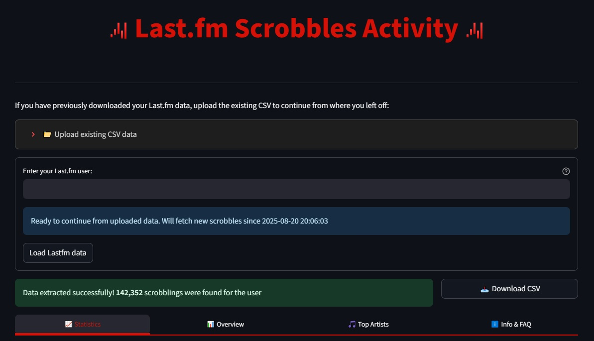
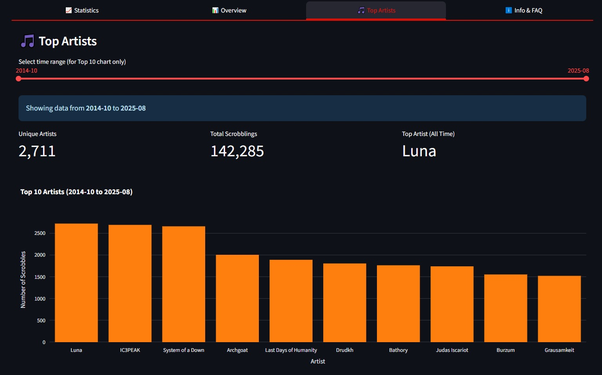

# Last.fm Scrobblings Dashboard v0.9

## What is this?

It is a dashboard that displays key metrics about your Scrobbles from Last.fm. The data is fetched in real time, and you can access different charts through the tabs.

## Some of the charts

### Streaks!

### Data filtered by artist and time period!

### Top Artist info!

### 🔧 Data & Technical Information

- **Primary data source**: Last.fm API (user.getRecentTracks Endpoint)  
- **Data processing**: Python  
- **Graphs**: Plotly  
- **App**: Streamlit  